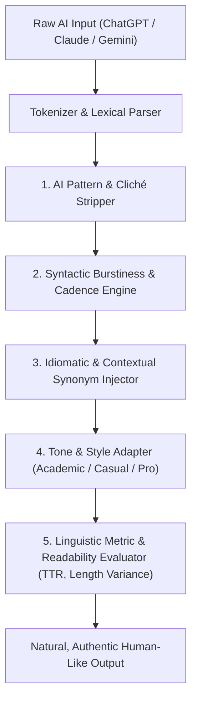

# HumanizeAI: Client-Side Natural Language Engine for AI Content Synthesis

[](https://developer.mozilla.org/en-US/docs/Web/JavaScript)
[](https://opensource.org/licenses/MIT)
[]()
[]()
[]()

An advanced, client-side Natural Language Processing (NLP) restructuring engine designed to transform robotic, formulaic AI-generated text (ChatGPT, Claude, Gemini) into natural, authentic, and engaging human prose.

Runs **100% locally in the browser** with zero external API calls, zero server latency, and complete user data privacy.

---

## 🖥️ Application Interface


---

## ⚡ Architecture & Linguistic Pipeline

LLM-generated text typically exhibits low **perplexity** (word choice predictability) and low **burstiness** (variation in sentence length and structure). This engine implements a multi-stage linguistic transformation pipeline to systematically humanize synthetic outputs:



---

## 🔬 Core Linguistic Engineering Strategies

1. **AI Cliché & Formulaic Transition Stripping:**
   * Eliminates dead giveaways of synthetic text (e.g., *"En conclusión"*, *"Es importante destacar que"*, *"Cabe señalar que"*, *"Sin lugar a dudas"*).
   * Replaces robotic connectors with organic conversational bridges, idioms, and natural discourse markers.
2. **Burstiness & Sentence Length Variation:**
   * Artificial intelligence tends to produce uniform sentence lengths. The engine deliberately fragments, combines, and punctuates sentences to introduce rhythmic variety (alternating short punchy observations with nuanced compound structures).
3. **Perplexity Elevation via Lexical Diversity:**
   * Utilizes comprehensive contextual transformation dictionaries to calculate Type-Token Ratio (**TTR**) and substitute overused high-probability tokens with dynamic synonyms.
4. **Context-Aware Tone Modulation:**
   * **Casual / Conversational:** Introduces natural rhythm, colloquial fillers, and energetic pacing.
   * **Professional / Corporate:** Polished, direct, and concise without academic stiffness.
   * **Academic:** Rigorous and structured while eradicating lazy LLM templates.
   * **Creative / Narrative:** Evocative phrasing with rich narrative pacing.
5. **Interactive UI & Real-Time Diff Inspection:**
   * Modern dark-mode responsive interface featuring live word counters, change counters, reading time estimation, and side-by-side comparison.

---

## 📁 Repository Structure

```
ai-text-humanizer/
├── index.html           # Modern responsive web interface & HUD controls
├── index.css            # Custom design system (dark-mode, glassmorphism, particles)
├── app.js               # Event-driven UI controller, animations, and telemetry
├── humanizer-engine.js  # Core linguistic engine, rule sets & NLP transformation dictionaries
├── .gitignore           # Clean workspace exclusions
└── README.md            # Technical documentation
```

---

## 🚀 Quickstart & Usage

### 1. Run Locally (Zero Setup Required)
Because this project uses vanilla web standards, **no build step, npm install, or runtime is required**:

1. Clone the repository:
   ```bash
   git clone https://github.com/YOUR_USERNAME/ai-text-humanizer.git
   cd ai-text-humanizer
   ```
2. Open `index.html` in any modern web browser (Chrome, Edge, Firefox, Safari).

### 2. Live Deployment via GitHub Pages
You can host this application for free on GitHub Pages in 10 seconds:
1. Go to your repository on GitHub.
2. Navigate to **Settings → Pages**.
3. Under **Branch**, select `main` and root `/`, then click **Save**.
4. Your humanizer web application will be live at `https://YOUR_USERNAME.github.io/ai-text-humanizer/`.

---

## 🛡️ Privacy & Security

* **100% Client-Side Execution:** Text is processed strictly in your browser's JavaScript V8/SpiderMonkey engine.
* **Zero Network Requests:** No text or telemetry is sent to any server, cloud API, or third-party service.
* **Safe for Confidential Data:** Suitable for sensitive drafts, essays, internal corporate communications, and research.

---

## 📜 License
This project is licensed under the MIT License - see the LICENSE file for details.
